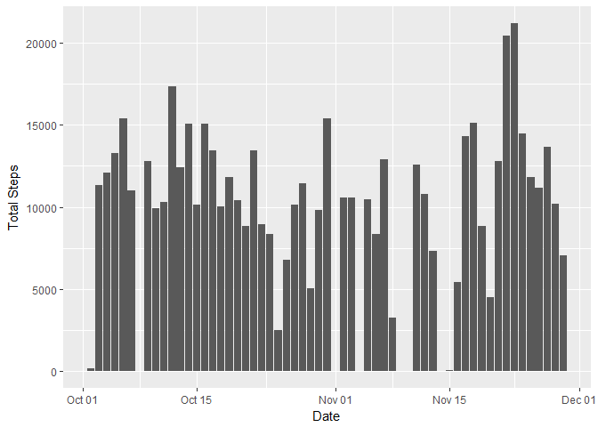
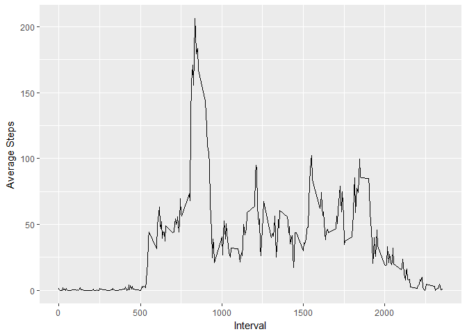
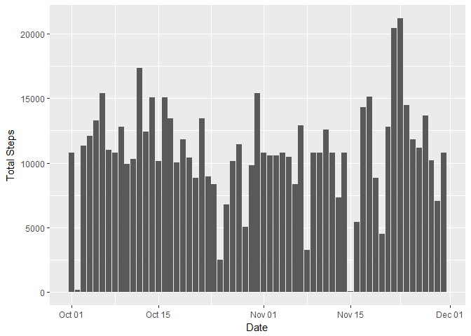
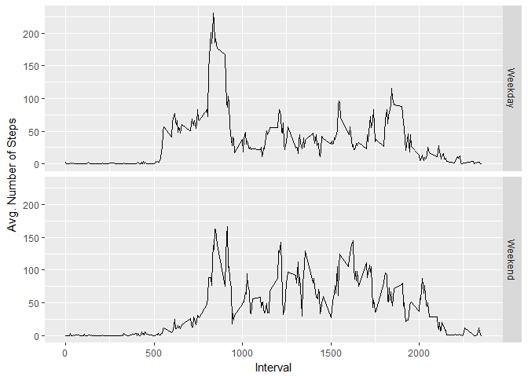

## Loading and preprocessing the data


```r
library(dplyr)
library(ggplot2)
myDataOrig<- read.csv("activity.csv")
myDataOrig$date<- as.Date(myDataOrig$date)
myData<- na.omit(myDataOrig)
```


## What is mean total number of steps taken per day?

```r
countByDate<- myData %>%
  group_by(date) %>%
  summarise(totalSteps = sum(steps, na.rm = FALSE))

#Histogram of the total number of steps taken each day
ggplot(data = countByDate, aes(x = countByDate$date, y = countByDate$totalSteps)) + geom_col() + labs(x = "Date", y = "Total Steps")
```

<!-- -->

```r
#Mean number of steps taken each day
mean(countByDate$totalSteps)
```

```
## [1] 10766.19
```

```r
#Median number of steps taken each day
median(countByDate$totalSteps)
```

```
## [1] 10765
```


## What is the average daily activity pattern?

```r
byInterval<- myData %>%
  group_by(interval) %>%
  summarise(average = mean(steps, na.rm = TRUE))

#Time series plot of the average number of steps taken
ggplot(data = byInterval, aes(x = byInterval$interval, y = byInterval$average)) + geom_line() + labs(x = "Interval", y = "Average Steps")
```

<!-- -->

```r
#The 5 minute interval that, on average, contains the max number of steps
as.numeric(byInterval[which(byInterval$average == max(byInterval$average)),1])
```

```
## [1] 835
```


## Imputing missing values


```r
#Code to describe and show a strategy for imputing missing data
sum(is.na(myDataOrig$steps))
```

```
## [1] 2304
```

```r
replaceWithMean<- function(x) ifelse(is.na(x), mean(x, na.rm = TRUE), x)

cleanedData<- myDataOrig %>%
  group_by(interval) %>%
  mutate(steps = replaceWithMean(steps))

countByDate<- cleanedData %>%
  group_by(date) %>%
  summarise(totalSteps = sum(steps, na.rm = FALSE))

#Histogram of the total number of steps taken each day after missing values are imputed

ggplot(data = countByDate, aes(x = countByDate$date, y = countByDate$totalSteps)) + geom_col() + labs(x = "Date", y = "Total Steps")
```

<!-- -->

```r
#With missing values imputed the mean and the median are now the same
mean(countByDate$totalSteps)
```

```
## [1] 10766.19
```

```r
median(countByDate$totalSteps)
```

```
## [1] 10766.19
```


## Are there differences in activity patterns between weekdays and weekends?


```r
returnDayType<- function(x) ifelse(x %in% c("Saturday","Sunday"),"Weekend","Weekday")

#Create a new factor variable in the dataset with two levels - "weekday" & "weekend" indicating whether a given date is a weekday or weekend
cleanedData<- cleanedData %>%
  ungroup(cleanedData) %>%
  mutate(dayType = as.factor(returnDayType(weekdays(date))))

byDayType<- cleanedData %>%
  group_by(dayType, interval) %>%
  summarise(average = mean(steps))

#Panel plot comparing the average number of steps taken per 5-minute interval across weekends and weekdays

ggplot(data = byDayType, aes(x = interval, y = average))+ geom_line() + facet_grid(dayType~.)+labs(x = "Interval", y = "Avg. Number of Steps")
```

<!-- -->

